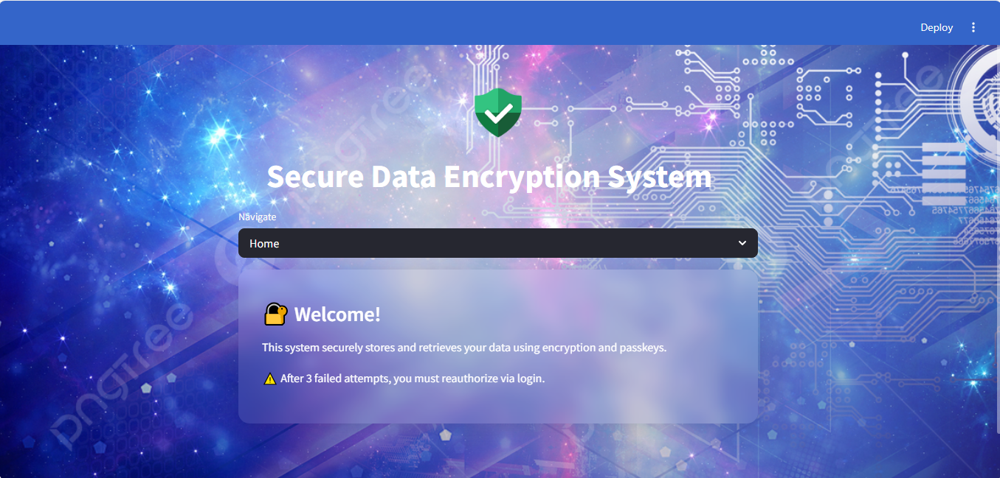

# 🔐 Secure Data Encryption System Using Streamlit

This is a secure web application built with **Python** and **Streamlit** that allows users to **encrypt** and **decrypt** sensitive data using a passkey. The app ensures data privacy using **Fernet encryption** and restricts access after multiple failed attempts.



---

## 🛠 Features

- 🔒 **Data Encryption & Decryption** using a custom passkey
- 🔐 **Fernet symmetric encryption**
- 🔃 **Session-based reauthorization** after 3 failed attempts
- 🌌 **Modern UI** with glassmorphism and background image
- 💾 No database needed — data is stored in-session securely

---

## 📦 Requirements

- Python 3.8+
- Streamlit
- cryptography

Install dependencies:

```bash
pip install -r requirements.txt
```

Or manually:

```bash
pip install streamlit cryptography
```

---

## 🚀 How to Run

```bash
streamlit run app.py
```

Then open the URL shown (usually `http://localhost:8501`) in your browser.

---

## 📁 Project Structure

```
📂 secure_data_app/
├── app.py                # Main Streamlit application
├── README.md             # This file
└── requirements.txt      # Required Python packages
```

---

## 🔐 Encryption Notes

- The passkey is hashed before matching
- The data is encrypted using Fernet (AES in CBC mode with HMAC)
- Each session is isolated; encrypted data will reset when the app restarts unless persistent storage is implemented

---

## 📸 UI Design Credits

Background image & shield icons by [Freepik](https://www.freepik.com/) & [Icons8](https://icons8.com/)

---

## 📣 Author

Created by **[Your Name Here]**  
For academic, demo, or small project use only.

---

## 📜 License

MIT License – use it freely, but don't forget to give credit 🙏
